1. [绘制一个点 - 代码](../../demos/webgl/class01.html)

效果：

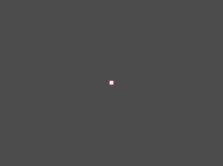;

2. [鼠标点击绘制一个点 - 代码](../../demos/webgl/class02.html)

效果：

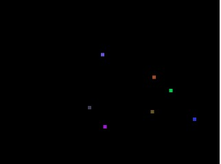;

3. [绘制一个三角形 - 代码](../../demos/webgl/class03.html)

效果：

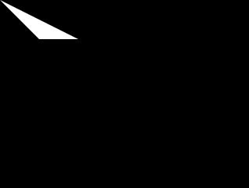;

4. [动态绘制一个三角形 - 代码](../../demos/webgl/class04.html)

效果：

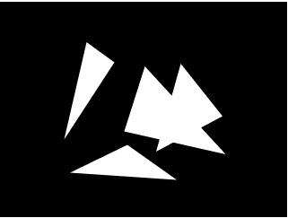;

5. [绘制线 - 代码](../../demos/webgl/class05.html)

效果：

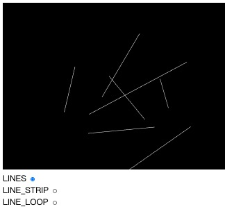;

6. [多buffer绘制渐变三角形 - 代码](../../demos/webgl/class06.html)

效果：

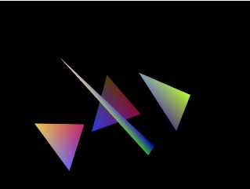;

7. [单buffer绘制渐变三角形 - 代码](../../demos/webgl/class07.html)

效果：

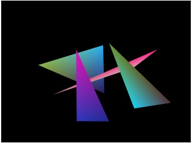;

8. [使用索引的方式绘制矩形 - 代码](../../demos/webgl/class08.html)

效果：

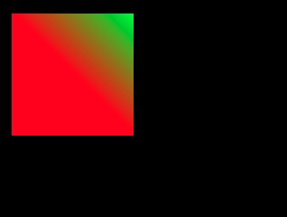;

9. [使用三角带的方式绘制矩形 - 代码](../../demos/webgl/class09.html)

效果：

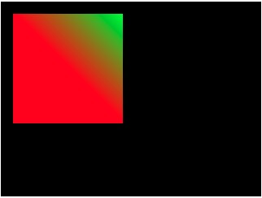;

10. [使用三角扇的方式绘制矩形 - 代码](../../demos/webgl/class010.html)

效果：

;

11. [简单的背面与正面显示 - 代码](../../demos/webgl/class011.html)

效果：

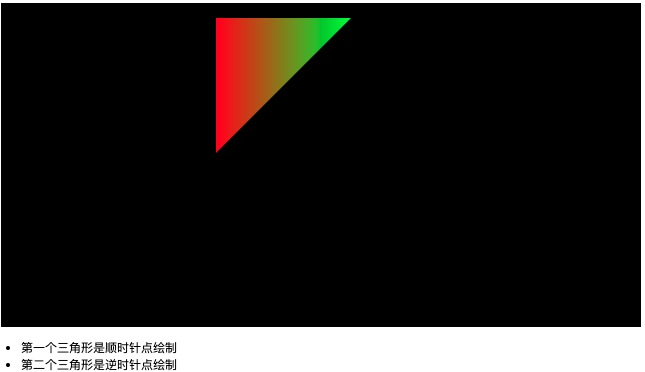;

12. [绘制圆形 - 代码](../../demos/webgl/class012.html)

效果：

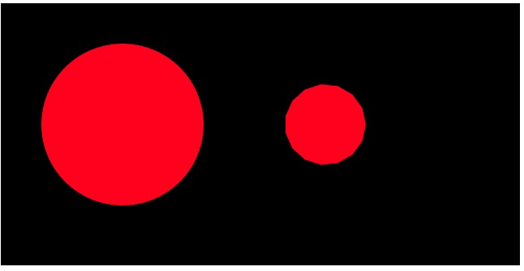;

13. [绘制空心圆 - 代码](../../demos/webgl/class013.html)

效果：

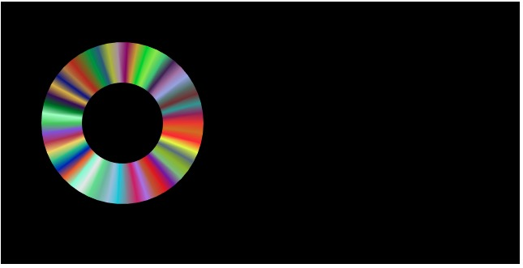;

14. [纹理贴图 - 代码](../../demos/webgl/class014.html)

效果：

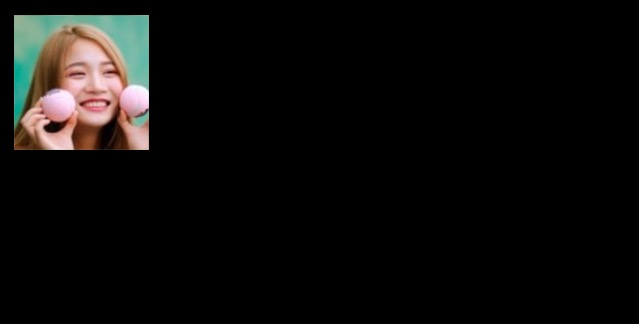;

15. [绘制简单立方体 - 代码](../../demos/webgl/class015.html)

效果：

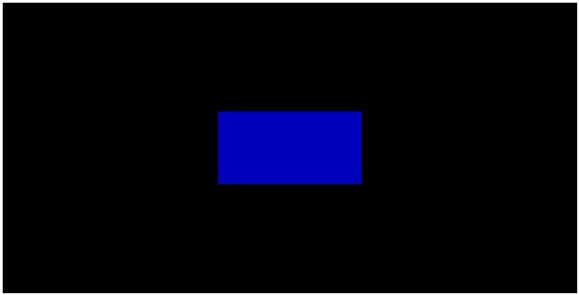;

16. [让正方体动起来 - 代码](../../demos/webgl/class016.html)

效果：

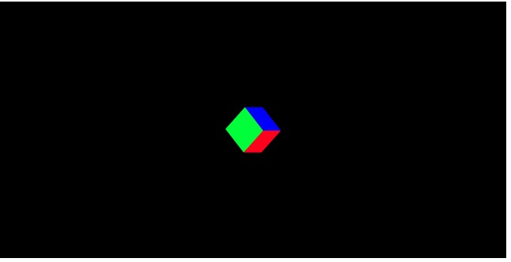;

17. [生成一个旋转的圆球 - 代码](../../demos/webgl/class018.html)

效果：

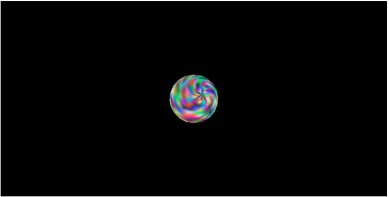;

18. [给圆球增加环境光 - 代码](../../demos/webgl/class019.html)

效果：

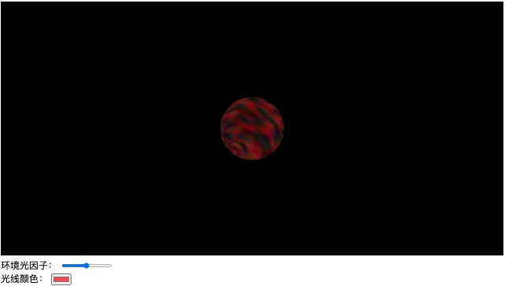;

19. 给球体增加漫反射 。。。 