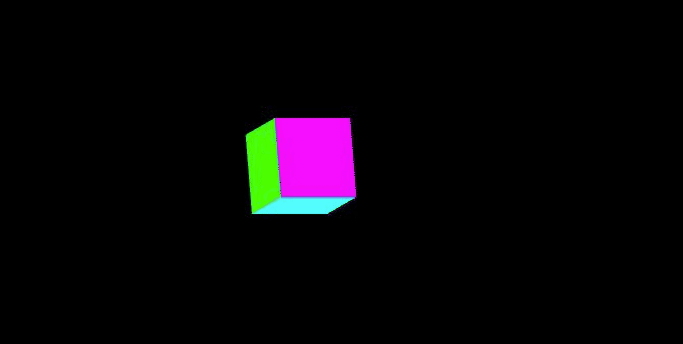
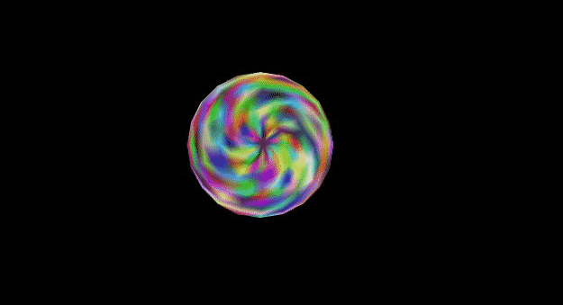
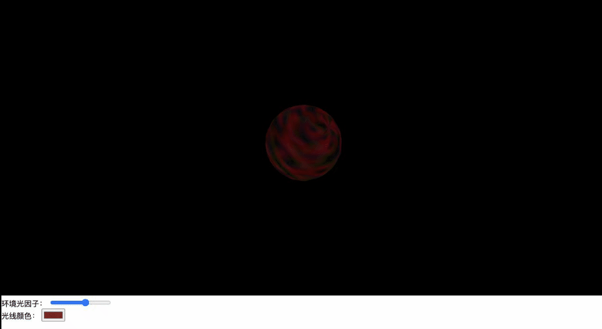

# webgl的简单学习

[tag]:webgl|js
[create]:2020-07-17

注意这里的效果链接应该都需要翻墙。

## 绘制一个点

👉 [代码](https://github.com/sansui-orz/blog/tree/master/demos/webgl/class01.html)

👉 [效果](https://sansui-orz.github.io/blog/demos/webgl/class01.html)

## 鼠标点击绘制一个点

👉 [代码](https://github.com/sansui-orz/blog/tree/master/demos/webgl/class02.html)

👉 [效果](https://sansui-orz.github.io/blog/demos/webgl/class02.html)

;

## 绘制一个三角形

👉 [代码](https://github.com/sansui-orz/blog/tree/master/demos/webgl/class03.html)

👉 [效果](https://sansui-orz.github.io/blog/demos/webgl/class03.html)

## 动态绘制一个三角形

👉 [代码](https://github.com/sansui-orz/blog/tree/master/demos/webgl/class04.html)

👉 [效果](https://sansui-orz.github.io/blog/demos/webgl/class04.html)

## 绘制线

👉 [代码](https://github.com/sansui-orz/blog/tree/master/demos/webgl/class05.html)

👉 [效果](https://sansui-orz.github.io/blog/demos/webgl/class05.html)

## 多buffer绘制渐变三角形

👉 [代码](https://github.com/sansui-orz/blog/tree/master/demos/webgl/class06.html)

👉 [效果](https://sansui-orz.github.io/blog/demos/webgl/class06.html)

## 单buffer绘制渐变三角形

👉 [单buffer绘制渐变三角形 - 代码](https://github.com/sansui-orz/blog/tree/master/demos/webgl/class07.html)

👉 [效果](https://sansui-orz.github.io/blog/demos/webgl/class07.html)

## 使用索引的方式绘制矩形

👉 [代码](https://github.com/sansui-orz/blog/tree/master/demos/webgl/class08.html)

👉 [效果](https://sansui-orz.github.io/blog/demos/webgl/class08.html)

;

## 使用三角带的方式绘制矩形

👉 [代码](https://github.com/sansui-orz/blog/tree/master/demos/webgl/class09.html)

👉 [效果](https://sansui-orz.github.io/blog/demos/webgl/class09.html)

## 使用三角扇的方式绘制矩形

👉 [代码](https://github.com/sansui-orz/blog/tree/master/demos/webgl/class10.html)

👉 [效果](https://sansui-orz.github.io/blog/demos/webgl/class10.html)

## 简单的背面与正面显示

👉 [代码](https://github.com/sansui-orz/blog/tree/master/demos/webgl/class11.html)

👉 [效果](https://sansui-orz.github.io/blog/demos/webgl/class11.html)

## 绘制圆形

👉 [代码](https://github.com/sansui-orz/blog/tree/master/demos/webgl/class12.html)

👉 [效果](https://sansui-orz.github.io/blog/demos/webgl/class12.html)

## 绘制空心圆

👉 [代码](https://github.com/sansui-orz/blog/tree/master/demos/webgl/class13.html)

👉 [效果](https://sansui-orz.github.io/blog/demos/webgl/class13.html)

## 纹理贴图

👉 [代码](https://github.com/sansui-orz/blog/tree/master/demos/webgl/class14.html)

👉 [效果](https://sansui-orz.github.io/blog/demos/webgl/class14.html)

## 绘制简单立方体

👉 [代码](https://github.com/sansui-orz/blog/tree/master/demos/webgl/class15.html)

👉 [效果](https://sansui-orz.github.io/blog/demos/webgl/class15.html)

## 让立方体动起来

👉 [代码](https://github.com/sansui-orz/blog/tree/master/demos/webgl/class16.html)

👉 [效果](https://sansui-orz.github.io/blog/demos/webgl/class16.html)

## 生成一个旋转的圆球

👉 [代码](https://github.com/sansui-orz/blog/tree/master/demos/webgl/class18.html)

👉 [效果](https://sansui-orz.github.io/blog/demos/webgl/class18.html)

## 给圆球增加环境光

👉 [代码](https://github.com/sansui-orz/blog/tree/master/demos/webgl/class19.html)

👉 [效果](https://sansui-orz.github.io/blog/demos/webgl/class19.html)

## 给球体增加漫反射

【待补充】
