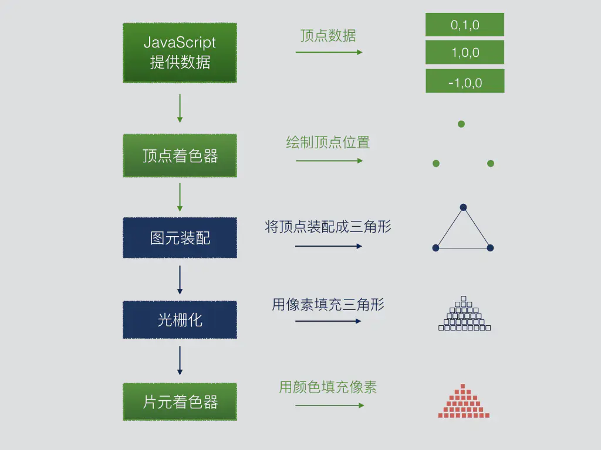

## 简单的绘制一个点

看之前建议先看一下这一章的[源码](../demos/webgl/class01.html)，跑起来看看。然后结合源码再一起看下面的内容。（源码很短）

### 粗识WebGL

一个简单的WebGL渲染管线如下图所示。

而我们能够插手的就只有绿色的那部分。提供数据，顶点着色器定位，片元着色器着色。

从源码中我们可以看到，前面有两段不是js的脚本。那是GLSL语言（OpenGL 着色语言）

它的作用是用来编写着色器程序的，着色器程序则是运行在GPU上的简短程序。

所以学习WebGL除了需要具备html,js知识。还需要掌握少量的GLSL语言。

