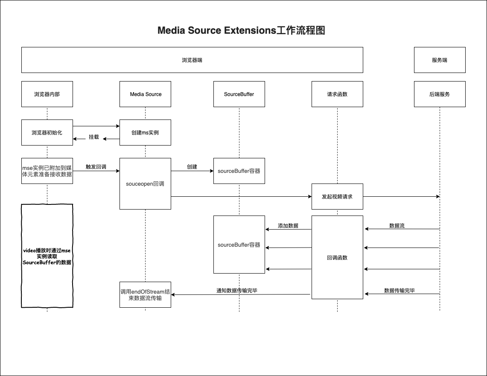

# 使用Media Source Extensions支持视频流播放

[Media Source Extensions](https://developer.mozilla.org/zh-CN/docs/Web/API/Media_Source_Extensions_API)提供了实现无插件且基于 Web 的流媒体的功能。

目前前端支持的flv.js/dash.js/hls.js等库均用到了MSE。但是对于MSE的简单使用方法并没有太多相关资料（至少我没有找到）。

最后参考[MSE（Media Source Extensions）的一点尝试](https://blog.csdn.net/weixin_41196185/article/details/82229244), 自己搭建了简单的一个视频流播放（不包含视频转码）。

[源码地址](../demos/video-live/mse)

## 搭建服务端视频流服务

搭建一个node的视频流服务，这里为了简单，不使用任何依赖，直接终端运行`node server`跑服务。

文件名：***server.js***

```js
const http = require('http');
const fs = require('fs');

const port = 3001;

const server = http.createServer((req, res) => {
  if (/\.mp4$/.test(req.url)) {
    res.statusCode = 200;
    res.setHeader('Content-Type', 'application/octet-stream');
    const stream = fs.createReadStream(__dirname + '/frag_bunny.mp4');
    stream.pipe(res);
  } else {
    res.statusCode = 200;
    res.setHeader('Content-Type', 'text/html; charset=utf-8');
    res.end(fs.readFileSync(__dirname + '/index.html'));
  }
});

server.listen(port, () => {
  console.log('open: http://localhost:' + port);
});
```

可以看到上面的服务很简单，当访问`.mp4`后缀的路由时，流式返回视频流数据。否则返回我们的静态页面。

但是需要注意不是所有mp4文件都可以流式传输的，使用普通mp4进行流式播放会报错，需要使用[fregament mp4](https://blog.csdn.net/lyuan1314/article/details/9289827)格式的视频才行。

这里我直接使用的是[MSE（Media Source Extensions）的一点尝试](https://blog.csdn.net/weixin_41196185/article/details/82229244)内提供的一个[fragament mp4文件](https://raw.githubusercontent.com/nickdesaulniers/netfix/gh-pages/demo/frag_bunny.mp4)。

通过

```js
res.setHeader('Content-Type', 'application/octet-stream');
const stream = fs.createReadStream(__dirname + '/frag_bunny.mp4');
stream.pipe(res);
```

简单将该mp4视频流下发。

紧接着开始写播放页面。

文件名 ***index.html***

```html
<!-- 省略 -->
<body>
  <video id="video"></video>
  <button>开始</button>
  <!-- https://blog.csdn.net/weixin_41196185/article/details/82229244 -->
  <script>
    let inited = false;
    let done = false;
    let intervalKey;
    const bufferCache = [];
    const video = document.getElementById('video');
    const mediaSource = new MediaSource();
    video.src = URL.createObjectURL(mediaSource);

    mediaSource.addEventListener('sourceopen', function() { // 实例已附加到媒体元素，准备接收或者正在接收数据 https://developers.google.com/web/fundamentals/media/mse/basics
      if (inited) return;
      inited = true;
      const sourceBuffer = mediaSource.addSourceBuffer('video/mp4;codecs="avc1.42E01E,mp4a.40.2"');
      sourceBuffer.addEventListener('updateend', function() {
        if (done && bufferCache.length === 0) {
          mediaSource.endOfStream();
        }
      });
      function intervalAppendSourceFromCache() {
        intervalKey = setInterval(() => {
          if (bufferCache.length > 0 && !sourceBuffer.updating) {
            console.log('定时器定时查询sourceBuffer状态并将缓存写入', bufferCache);
            const bufferOnHead = bufferCache.shift();
            sourceBuffer.appendBuffer(bufferOnHead);
          }
          if (bufferCache.length === 0 && done) {
            clearInterval(intervalKey);
          }
        }, 200);
      }

      intervalAppendSourceFromCache();

      fetch('./video.mp4').then(function(res) {
        console.log('查看返回直播数据流', res);
        return res.body.getReader();
      }).then(readStream);

      function readStream(resp) {
        return resp.read().then((result) => {
          console.log('将数据流读出来', result);
          done = result.done;
          if (!result.done) {
            if (sourceBuffer.updating) {
              console.log('sourceBuffer正在处理，先讲数据丢进缓存列表', bufferCache);
              bufferCache.push(result.value.buffer);
            } else {
              if (bufferCache.length > 0) {
                const bufferOnHead = bufferCache.shift();
                console.log('从缓存列表获取缓存插入到sourceBuffer', bufferOnHead);
                bufferCache.push(result.value.buffer);
                sourceBuffer.appendBuffer(bufferOnHead);
              } else {
                console.log('正常将流数据插入sourceBuffer', result.value.buffer);
                sourceBuffer.appendBuffer(result.value.buffer);
              }
            }
            return readStream(resp); // 递归调用读取resp
          } else {
            console.log('done');
          }
        });
      }
    });
    document.querySelector('button').onclick = function() {
      video.play();
    };
  </script>
</body>
<!-- 省略 -->
```

上面的数据获取以及数据插入的逻辑稍微复杂一丢丢，可以参照下面的流程图理解:



需要注意在代码中获取到视频数据并不是直接将数据添加到sourceBuffer的，而是简单的维护了一个缓存数组，在使用一个定时器去循环查询sourceBuffer的状态是否是updateing的状态，这是因为如果网络很流畅的情况下，fetch的回调会短时间内大量触发，而sourceBuffer一次只能处理一段视频数据，所以其他的数据则需要等待前面的数据处理完毕之后才能够添加给sourceBuffer。

还有就是sourceopen回调的触发时机，在网上搜索了挺久都没有看到哪里有介绍sourceopen是什么时候触发回调的，最后在[Media Source Extensions](https://developers.google.com/web/fundamentals/media/mse/basics)这篇文章发现，该回调会在**实例已附加到媒体元素，准备接收或者正在接收数据**时触发。

将play事件绑定在button的click事件内则是因为chrome不允许网页自动播放，必须要在用户有主动触发的行为才行。

## 总结

就这样一个简单的视频流播放就实现了，尽管它只有简单的播放实现，但是了解到mse是怎么工作的，就对其他视频转码插件如flv.js/hls.js/dash.js等有了一个简单的认识，使用起来更加得心应手。

## 更多功能

1. 实现视频回放功能。

2. 在fetch回调到appendBuffer之间进行数据转换，以支持更多视频格式。

3. 构思一下清晰度切换应该如何实现。

## 参考资料

[Media Source Extensions](https://developers.google.com/web/fundamentals/media/mse/basics)

[MSE（Media Source Extensions）的一点尝试](https://blog.csdn.net/weixin_41196185/article/details/82229244)

[Media Source Extensions](https://developer.mozilla.org/zh-CN/docs/Web/API/Media_Source_Extensions_API)
