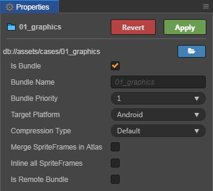

# 前端性能优化总结

## 首屏加载优化

### 分包加载

提到首屏加载优化，最先想到的应该还是分包加载。分包加载指的就是通过代码拆分的手段，将首屏代码资源单独分出一个代码包（js文件），当然，大部分时候还可能会拆除一个公用包用来承载一些公用库（如react.js / axios.js等）。

而分包的手段在日常工作中已经是十分常见了，不论是webpack分包，小程序分包，亦或是小游戏分包。目前都已经提供了比较成熟的解决方案。

这里简单介绍一下这几种分包方式的用法：

#### webpack分包

```javascript
const path = require('path');
const webpack = require('webpack');
const HTMLWebpackPlugin = require('html-webpack-plugin');

module.exports = {
  entry: {
    index: './src/index.js',
    another: './src/another-module.js'
  },
  plugins: [
    new HTMLWebpackPlugin({
      title: 'Code Splitting'
    }),
    new webpack.optimize.CommonsChunkPlugin({
      name: 'common' // 指定公共 bundle 的名称。
    })
  ],
  output: {
    filename: '[name].bundle.js',
    path: path.resolve(__dirname, 'dist')
  }
};
```

代码如上，该webpack指定了两个`entry`，并且使用`CommonsChunkPlugin`插件将公用模块拆成一个独立的代码包，最终会生成`index.bundle.js`，`another.bundle.js`，`common.bundle.js`。

而在加载的时候只会加载指定的`entry`包以及公共包，如果在业务代码比较庞大的时候，将非首页的，非必要的，非常用的代码单独拆分成一个或几个包就非常的必要了。

ps: 还有一种方式是，不需要指定多个`entry`，而是使用[`import()`动态加载功能](https://www.webpackjs.com/api/module-methods/#import-)

#### 小程序(以微信小程序为例)分包

小程序内分包又可以有两种形式，第一种是常规的分包，即分为主包以及多个小包。第二种则是根据独立功能拆分出独立包。

首先是常规分包，只需要在`app.json`内设置`subpackages`字段，在打包是构建工具就会将代码按照配置打包成多个包。

注意的是配置是按照页面路径来区分分包逻辑的，那么此时如果多个子包应用了同一模块，那么该模块将会被打入主包，这样才能够被多个子包复用。

所以打包逻辑一般遵循“首页（或者几个访问量大的）页面打在主包，其他自包根据功能是否递进或耦合进行拆分”的规则。

```json
{
  "pages":[
    "pages/index",
    "pages/logs"
  ],
  "subpackages": [
    {
      "root": "packageA",
      "pages": [
        "pages/cat",
        "pages/dog"
      ]
    }, {
      "root": "packageB",
      "name": "pack2",
      "pages": [
        "pages/apple",
        "pages/banana"
      ]
    }
  ]
}
```

第二种形式是拆分独立包，这种模式一般运用在某个访问量大，独立，功能单一的页面。

比如： 某某火车票抢票小程序的分享好友加速，某某生鲜小程序的分享红包页面等。

可以注意到应用独立包的场景都是符合“访问量大，独立，功能单一”的场景，因为这些场景不依赖其他逻辑，一般仅仅是拉回流用户，引导用户进入小程序消费，所以需要做到快速响应，先让用户进来，再通过红包/折扣的诱惑引导用户进一步消费。

这时候就非常考验该页面的加载性能，一般这种场景都是用户点击分享卡片进入，目标性较差，如遇到加载时间较长很容易失去耐心直接退出。而独立包则十分完美的满足了这种场景需求。

配置方面，仅需将该分包的`independent`设为true就可以了，但是需要注意的是，该页面不要包含大的模块，否则打出来的包大了，就起不到”小而精“的作用了。且独立包与其他包是独立的，也就是说就算主包与独立包引用了同一模块，那独立报与主包都会包含该模块。

```json
{
  "pages": [
    "pages/index",
    "pages/logs"
  ],
  "subpackages": [
    {
      "root": "moduleA",
      "pages": [
        "pages/rabbit",
        "pages/squirrel"
      ]
    }, {
      "root": "moduleB",
      "pages": [
        "pages/pear",
        "pages/pineapple"
      ],
      "independent": true
    }
  ]
}
```

#### 小游戏分包(以微信小游戏 && cocos creator为例)

微信小游戏也支持分包加载的配置，配置方式跟小程序配置是一样的，只需要配置一下`game.json`的`subpackages`字段就可以了。

```json
{
  ...
  "subpackages": [
    {
      "name": "stage1",
      "root": "stage1/" // 可以指定一个目录，目录根目录下的 game.js 会作为入口文件，目录下所有资源将会统一打包
    }, {
      "name": "stage2",
      "root": "stage2.js" // 也可以指定一个 JS 文件
    }
  ]
  ...
}
```

而加载则使用[wx.loadSubpackage()](https://developers.weixin.qq.com/minigame/dev/guide/base-ability/sub-packages.html)api来触发分包的下载。

而cocos creator也在v2.4.0版本支持了分包的[配置](https://docs.cocos.com/creator/manual/zh/scripting/asset-bundle.html#%E9%85%8D%E7%BD%AE%E6%96%B9%E6%B3%95)，
配置的方式是在编辑内根据文件夹配置来分包。



加载则是使用[cc.assetManager.loadBundle()](https://docs.cocos.com/creator/manual/zh/scripting/asset-bundle.html#%E9%85%8D%E7%BD%AE%E6%96%B9%E6%B3%95)api来控制分包的加载。

很不幸的是，v2.4.0刚出不到一个月，暂时还没上手尝试，不过按照惯例，估计坑不少。

以上就是代码分包的几个场景了，往往代码分包产生的效益是立竿见影的，这也是为什么它频繁被提起的原因，首次加载的资源少了，加载速度自然就上来了。

### 图片优化

通常一个互联网项目少不了图片的出现，web最初也只是用来承载文本与图片，只是在时代发展下逐渐扩充了其功能，才形成目前五花八门的应用场景（视频/音频等）。

而归根结底，文本与图片的应用也是重中之重。众所周知，图片的质量越大，加载则越慢。应该接触过互联网的人都有经历过网络慢的时候，打开一个网页肯定是文字先出来，然后才是图片。

这是因为文本小且它是跟文档一起被加载的，而图片则是在文档被解析中或解析后才发出的请求。在本身加载就比较靠后的情况下，如果图片还大，则会出现加载很久甚至加载失败的情况，而这种状况在你看来正常，但是在用户眼中，就是优化不当或者产品bug。

由于图片优化内容比较多，所以单独拎出来作为一块，请移步[图片优化实践](./图片优化实践.md)
