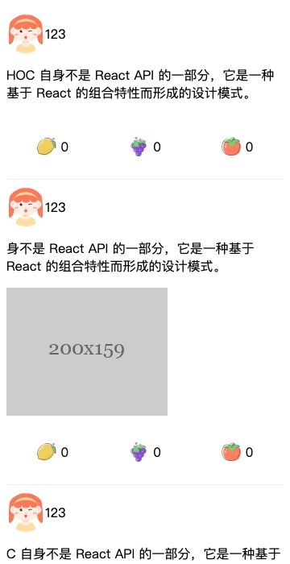

# 长列表优化方案解析

👉 [react-infinite-auto-scroller](https://github.com/sansui-orz/react-infinite-auto-scroller)

日常工作中，经常遇到长列表（商品列表，社区帖子列表，动态列表，视频流……）。所以也了解当用户刷到了大量内容时，由于DOM数量激增，页面的性能面临的挑战。

而对长列表的优化库也有很多，但是实际应用到项目中大多又不匹配，要么固定高度，要么需要定制逻辑。所以我们就自己手动写一遍长列表的优化，了解优化概念以及其中的问题。

## 构建简易的列表

首先我们先搭建一个简易的列表组件

新建list.tsx

```tsx
import React, { Component } from 'react';
import Item from '../item';

export default class List extends Component<{}, {
  list: Array<{ text: string; img?: string; }>
}> {
  private refList = React.createRef<HTMLDivElement>();

  private lock = false;

  state = {
    list: [],
  };
  
  componentDidMount() {
    this.setState({
      list: this.getList(50),
    });
    window.addEventListener('scroll', this.listenScroll, false); // 监听是否滚动到底部，进行触底加载
  }

  componentWillUnmount() {
    window.removeEventListener('scroll', this.listenScroll, false); // 卸载时移除事件监听
  }

  render() {
    return (
      <div className="list" ref={this.refList}>
        <div className="count">{this.state.list.length}</div>
        {this.state.list.map((item: { text: string; img?: string; }, index) => {
          return (
            <Item key={index} text={item.text} img={item.img} /> // 列表项，这里后面需要更换称无限滚动组件
          );
        })}
      </div>
    );
  }

  // 简单实现触底加载
  private listenScroll = () => { // 监听是否到底部
    if (this.lock) return;
    // 防抖
    this.lock = true;
    setTimeout(() => {
      this.lock = false;
    }, 100);
    const targetEle = this.refList?.current;
    if (targetEle) {
      const { bottom } = targetEle.getBoundingClientRect();
      // 如果距离底部还有半屏
      if (bottom < window.innerHeight * 1.5) {
        const list: Array<{ text: string; img?: string; }> = this.state.list;
        this.setState({
          list: list.concat(this.getList(50)),
        });
      }
    }
  };

  private getList(len: number) { // mock数据接口请求
    const list: Array<{ text: string; img?: string; }> = [];
    for (var i = 0; i < len; i++) {
      list.push(this.getItem());
    }
    return list;
  }

  private getItem(): { text: string, img?: string } {
    const t = '高阶组件（HOC）是 React 中用于复用组件逻辑的一种高级技巧。HOC 自身不是 React API 的一部分，它是一种基于 React 的组合特性而形成的设计模式。';
    return {
      text: t.substr(Math.floor(Math.random() * t.length / 2), t.length / 2 + Math.floor(Math.random() * t.length / 2)), // 随机截取一段文本
      img: Math.random() > 0.6 ? `http://iph.href.lu/200x${Math.floor(100 + Math.random() * 300)}` : '', // 随机添加一张图片
    };
  }
}
```

新建item.tsx，为了尽量还原实际应用场景，我们可以尽量增加一些元素。

```tsx
import React, { Component } from 'react';

import './index.css';

interface IProps {
  text: string;
  img?: string;
}

class Item extends Component<IProps> {
  render() {
    const { text, img } = this.props;
    return (
      <div className="item">
        <div className="user">
          
          <div className="username">123</div>
        </div>
        <p className="text">{text}</p>
        {img ?  : null}
        <div className="controls">
          <div className="action1">
            
            0
          </div>
          <div className="action2">
            
            0
          </div>
          <div className="action3">
            
            0
          </div>
        </div>
      </div>
    );
  }
}


export default Item;
```

此时的列表看上去长这样⬇️



此时，我们列表有多少项，就会有多少个Item组件。

## 为什么会卡

接着我们来设计长列表优化的逻辑，首先我们需要搞清楚为什么列表长了会卡顿，我总结了一下有以下两个原因：

1. React渲染吃力，当react的虚拟DOM结构复杂时，DOM更新就会明显耗时（因为DIFF算法需要遍历新旧DOM结构）

2. 大量DOM操作，即使是React Diff节点速度够快，但是涉及到大量dom节点变更需要与dom进行交互，要知道dom操作都是同步的，且dom操作耗时并会阻塞js往下执行，所以当大量dom交互时，页面会变得明显卡顿。

## 解决方案

针对长列表卡顿我们知道了原因，就可以针对性的对其进行优化了。

从原因来看，主要问题在于列表长了之后，DOM结构的复杂度增加，导致js调用时间长，dom渲染频繁。

### 第一个想法

既然是因为dom结构复杂，那我们减少dom数量与结构不就好咯。我脑中的第一个想法是这样的，并且立即写出了大概的解决方法。

```tsx
const map = new Map();

const intersectionObserver = new IntersectionObserver((entrys) => {
    entrys.forEach((entry) => {
        const target = entry.target;
        const handle = map.get(target);
        handle && handle(entry.intersectionRadio > 0);
    });
}, { rootMargin: '50% 50% 50% 50%' });

export default function createInfiniteScrollItem(Component) {
  return class InfiniteScrollItem extends React.Component {
    state = {
      show: true,
      height: 0,
      ready: false,
    };

    private ref = React.createRef<HTMLDivElement>();

    componentDidMount() {
      const current = this.ref.current;
      map.set(current, (show: boolean) => {
        if (this.state.ready && show !== this.state.show) {
          this.setState({ show });
        }
      });
      intersectionObserver.observe(current);
    }

    componentWillUnmount() {
      const current = this.ref.current;
      intersectionObserver.unobserve(current);
      map.delete(current);
    }

    render() {
      return (
        <div ref={this.ref} style={{ height: this.state.height || 'auto' }}>
          {(this.state.show && this.state.ready) ? <Component {...this.props} infiniteReady={this.readyHandle} infiniteReportHeight={this.reportHeight}> : null}
        </div>
      );
    }

    private reportHeight = (height: number) => {
      this.setState({ height });
    };

    private readyHandle = () => {
      this.setState({ ready: true, show: this.getVisibility() });
    }

    private getVisibility = () => {
      const rect = this.ref.current.getBoundingClientRect();
      const wh = window.innerHeight;
      const ww = window.innerWidth;
      return rect.top > -0.5 * wh && rect.bottom < 1.5 * wh && rect.left  < 1.5 * ww && rect.right > -0.5 * ww;
    }
  }
}
```

解释一下上面的代码

1. 首先，声明一个`IntersectionObserver`实例来监听节点的隐藏与显示

2. 声明一个map对象将dom元素与回调进行关联

3. 声明一个高阶函数`createInfiniteScrollItem`，用来包裹列表项组件，同时提供曝光显示，隐藏删除的逻辑

主要的逻辑都在高阶组件里面，该组件仅仅只是给列表项组件包裹了一层div，借着这个div节点，监听其隐藏与显示，同时当Component准备完毕时可以上报ready, 此时监听到节点显示隐藏是才会改变show属性。

需要注意的是，当`infiniteReady`调用是，该组件可能已经处于隐藏状态，而此时需要主动判断一下当前元素的显示隐藏, 如果不调用，就只能等到下次元素可见性变化时才能起效，这是不合理的。

而列表项组件内也需要通过`infiniteReportHeight`方法上报高度，只有上报高度的组件才能被隐藏，因为这样才不会影响到页面整体的布局。

特别需要注意的是，当组件被卸载时注意将intersectionObserver与map数据清除，否则会内存泄漏。

这样我们就简单的实现了第一个无限加载的组件，当我们运行起来的时候会发现，如果是滑的慢的话，似乎没有什么问题，但是当你快速滑动时，就会发现页面变得很卡，比优化前还要卡。这是为什么呢？

这是因为我们频繁的调用了setState去改变变化的组件，这就导致当快速滑动时，一下变化的组件太多，就产生了很多的setState，要知道setState的时候并不单单只是调用一个函数那么简单，用“冰山一角”来形容这个方法再适合不过了。

这也就导致了大量的setState导致了大量js调用堆积，导致页面卡顿，大量js堆积又会导致IntersectionObserver无法被调用，因为IntersectionObserver是在浏览器空闲时才会被调用的，这就是为什么会那么卡的原因了。

所以这个方法表面上看似乎行得通，但是其实是不对的，尤其是大量的setState都是单独的调用，并不会被合并，性能的损耗是极大的。

那么有没有办法能够合并setState呢，目前来看只有在同一个class内，或者使用类似redux, mobx这类的第三方库才能实现了。

考虑到如果使用redux, mobx此类的库，这个单纯的项目就比较重了，感觉没什么必要。

那么根据优化目标，我们把list抽到一个组件内，此时我们就不能用一个高阶函数来实现了。

抽离出InfiniteScroll组件。

```tsx
export default class InfiniteScroll extends Component {
  render() {
    const list2 = this.sortList(this.state.list);
    return (
      <div className="infinite-scroll">
        {list2.map((item, index) => {
          const key = this.props.id ? item[this.props.id] : index;
          return (
            <InfiniteScrollItem
              key={}
              index={item.is_index}
              is_height={item.is_height}
              reportHeight={reportHeight}
              renderItem={this.renderItem}
              item={item}
            />
          );
        })}
      </div>
    );
  }
}
```

看上面的代码，可以看到有个sortList的方法，这个方法的作用是，使用js判断哪些组件是显示的，哪些组件是隐藏的。

为什么要使用js判断呢? 因为js运行速度快。。。

待续。。。

## 具体实现

## 总结
